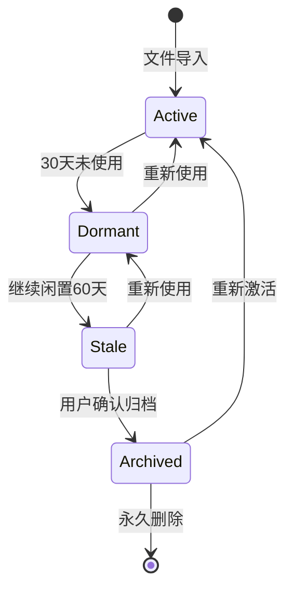

# PARA 文件生命周期管理设计方案

> 基于 PARA 方法论的文件状态流转与生命周期管理系统设计

---

## 📋 目录

1. [背景与目标](#背景与目标)
2. [PARA 四象限本质分析](#para-四象限本质分析)
3. [文件生命周期状态机](#文件生命周期状态机)
4. [核心流转路径](#核心流转路径)
5. [流转规则详解](#流转规则详解)
6. [数据模型设计](#数据模型设计)
7. [规则引擎扩展](#规则引擎扩展)
8. [用户界面设计](#用户界面设计)
9. [实现路线图](#实现路线图)

---

## 📖 背景与目标

### 背景

PARA 方法论（Projects / Areas / Resources / Archives）由 Tiago Forte 提出，是一种高效的个人知识管理框架。在 FileFlow 中，我们基于此方法论设计文件组织结构，但目前缺乏对**文件生命周期**的系统性管理。

### 问题现状

1. 文件被归类后缺乏后续状态追踪
2. 项目完成后，文件无法自动流转到归档
3. 资源长期未使用也不会提示清理
4. 文件在不同 PARA 分类间的转移缺乏规范引导

### 设计目标

| 目标 | 描述 |
|------|------|
| **自动化** | 基于规则自动检测并建议文件流转 |
| **可追溯** | 记录每次流转的原因和时间 |
| **非破坏性** | 所有自动操作需用户确认，历史可回溯 |
| **智能化** | 结合 AI 分析提供流转建议 |

---

## 🎯 PARA 四象限本质分析

### 维度矩阵

```
                    高行动性
                       ▲
                       │
         Projects      │      Areas
        (短期目标)      │    (长期责任)
                       │
    ◄──────────────────┼──────────────────►
        短期/明确      │      长期/持续
                       │
         Resources     │      Archives
        (潜在价值)      │    (历史参考)
                       │
                       ▼
                    低行动性
```

### 详细定义

| 分类 | 核心定义 | 时间属性 | 行动频率 | 典型内容 |
|------|----------|---------|----------|----------|
| **Projects** | 有明确终点和交付物的任务 | 1周~6个月 | **高** (每日使用) | 项目文档、设计稿、代码、会议记录 |
| **Areas** | 需持续维护的责任领域 | 无终点 | **中** (周期性) | 健康记录、财务管理、职业发展 |
| **Resources** | 未来可能有用的参考资料 | 不确定 | **低** (按需使用) | 教程、模板、研究报告、灵感素材 |
| **Archives** | 已完成或不再活跃的内容 | 已结束 | **零** (仅查阅) | 完成的项目、离职公司资料、过期证书 |

### 关键洞察

> [!IMPORTANT]
> **行动性**是区分 PARA 四象限的核心维度：
> - Projects/Areas = **活跃区**（需要行动）
> - Resources/Archives = **沉淀区**（备查不动）

---

## ⏳ 文件生命周期状态机

### 状态定义



### 详细状态

| 状态 | 英文 | 描述 | 触发条件 |
|------|------|------|----------|
| 🟢 **活跃** | Active | 正在使用中 | 30天内有访问记录 |
| 🟡 **休眠** | Dormant | 暂时未使用 | 30-90天未访问 |
| 🟠 **过期候选** | Stale | 可能需要归档 | 90天以上未访问 |
| ⚫ **已归档** | Archived | 已移至 Archives | 用户确认或规则触发 |

### 状态检测时机

- **被动检测**：用户打开文件详情时更新状态
- **定时扫描**：每日后台任务检测所有文件状态
- **手动触发**：用户执行"检查清理建议"操作

---

## 🔄 核心流转路径

### 流转全景图

```
┌─────────────────────────────────────────────────────────────────────────────┐
│                           PARA 文件流转全景图                                 │
├─────────────────────────────────────────────────────────────────────────────┤
│                                                                             │
│    ┌──────────────┐                              ┌──────────────┐          │
│    │              │◄──────── 资源激活 ───────────│              │          │
│    │   Projects   │         (模板/参考应用)       │  Resources   │          │
│    │   (项目)     │                              │   (资源)     │          │
│    │              │────── 项目产出(可复用) ──────►│              │          │
│    └──────┬───────┘                              └──────┬───────┘          │
│           │                                             │                  │
│     项目完成│ │项目演变为持续责任            不再关注│ │资源过期              │
│           │ │                                     │ │                      │
│           │ ▼                                     │ ▼                      │
│    ┌──────▼──────┐                              ┌──────▼──────┐            │
│    │              │◄──────── 领域降级 ───────────│              │          │
│    │   Archives   │         (不再持续跟踪)        │    Areas     │          │
│    │   (归档)     │                              │   (领域)     │          │
│    │              │◄───────── 领域解散 ──────────│              │          │
│    └──────────────┘          (职责结束)           └──────────────┘          │
│                                                                             │
│    ════════════════════════════════════════════════════════════════════    │
│    图例: ───► 主流转方向   ◄─── 反向激活                                     │
│                                                                             │
└─────────────────────────────────────────────────────────────────────────────┘
```

### 流转频率统计（基于经验）

| 流转路径 | 频率 | 备注 |
|----------|------|------|
| Projects → Archives | ⬛⬛⬛⬛⬛ 最高 | 项目完成是最常见场景 |
| Projects → Resources | ⬛⬛⬛⬜⬜ 中等 | 项目产出复用 |
| Areas → Archives | ⬛⬛⬛⬜⬜ 中等 | 领域结束/离职 |
| Resources → Archives | ⬛⬛⬜⬜⬜ 较低 | 资源过期 |
| Resources → Projects | ⬛⬛⬜⬜⬜ 较低 | 资源激活 |
| Projects → Areas | ⬛⬜⬜⬜⬜ 罕见 | 项目变持续责任 |
| Areas → Resources | ⬛⬜⬜⬜⬜ 罕见 | 领域降级 |
| Resources → Areas | ⬛⬜⬜⬜⬜ 罕见 | 资源固化 |

---

## 📋 流转规则详解

### 1️⃣ Projects → Archives（项目归档）

**最常见流转路径**

| 触发条件 | 自动化程度 | 说明 |
|----------|-----------|------|
| 用户标记项目完成 | 手动触发 | 提供"归档项目"按钮 |
| 项目文件夹90天无变更 | 半自动 | 弹窗建议，需确认 |
| 项目截止日期已过 | 半自动 | 基于项目元数据 |

**归档策略选项**：
```
┌─────────────────────────────────────────────┐
│  🗂️ 项目 "2024年度报告" 已完成              │
│                                             │
│  请选择归档策略:                             │
│                                             │
│  ○ 整体归档 - 所有文件移至 Archives          │
│  ○ 智能归档 - 提取可复用文件到 Resources     │
│  ○ 暂不处理 - 30天后再次提醒                 │
│                                             │
│        [ 取消 ]        [ 确认归档 ]          │
└─────────────────────────────────────────────┘
```

---

### 2️⃣ Projects → Resources（项目产出复用）

**提取可复用资产**

| 文件类型 | 复用场景 | 目标位置 |
|----------|----------|----------|
| 模板文件 | 合同/报告/PPT模板 | Resources/Templates |
| 代码片段 | 可复用组件/脚本 | Resources/Code |
| 设计规范 | 品牌/UI/交互规范 | Resources/Design |
| 研究成果 | 市场/技术研究报告 | Resources/Research |

**实现方式**：
- 项目完成时 AI 自动识别可复用资产
- 用户手动标记"设为可复用资源"

---

### 3️⃣ Projects → Areas（项目升级）

**罕见但重要的路径**

| 场景 | 示例 |
|------|------|
| 项目变产品 | "个人博客项目" → "内容创作(领域)" |
| 任务变职责 | "学习Python项目" → "技术学习(领域)" |
| 临时变常态 | "疫情应急项目" → "健康管理(领域)" |

---

### 4️⃣ Areas → Archives（领域解散）

| 触发条件 | 示例 |
|----------|------|
| 职责结束 | 离职后，原公司相关领域归档 |
| 兴趣变化 | 不再健身，相关资料归档 |
| 生活阶段变化 | 孩子成年，育儿领域归档 |

---

### 5️⃣ Areas → Resources（领域降级）

**领域中的内容变为纯参考**

| 场景 | 处理方式 |
|------|----------|
| 旧版技术文档 | 保留参考，降级到 Resources |
| 不再跟踪的行业研究 | 作为历史参考保留 |
| 过期但有价值的方法论 | 保留作为灵感来源 |

---

### 6️⃣ Resources → Projects（资源激活）

**参考资料被应用于具体项目**

```
[Resources/Templates/合同模板.docx]
           │
           │ 新项目启动，需要合同
           ▼
[Projects/客户A项目/合同_v1.docx] (复制)
```

> [!NOTE]
> 资源激活通常是**复制**而非移动，原资源保留在 Resources。

---

### 7️⃣ Resources → Areas（资源固化）

**资源成为持续参考的标准**

| 场景 | 示例 |
|------|------|
| 建立个人知识库 | 收集的写作素材 → 写作领域 |
| 形成个人标准 | 投资研究 → 财务管理领域 |

---

### 8️⃣ Resources → Archives（资源过期）

| 触发条件 | 示例 |
|----------|------|
| 技术淘汰 | Flash 教程、IE 兼容方案 |
| 信息过时 | 3年前的行情分析 |
| 已完成使用 | 已读完的电子书 |

---

## 💾 数据模型设计

### 文件生命周期状态

```swift
// MARK: - File Lifecycle Stage
enum FileLifecycleStage: String, Codable, CaseIterable {
    case active = "active"       // 🟢 活跃
    case dormant = "dormant"     // 🟡 休眠
    case stale = "stale"         // 🟠 过期候选
    case archived = "archived"   // ⚫ 已归档
    
    var displayName: String {
        switch self {
        case .active: return "活跃"
        case .dormant: return "休眠"
        case .stale: return "待清理"
        case .archived: return "已归档"
        }
    }
    
    var icon: String {
        switch self {
        case .active: return "circle.fill"
        case .dormant: return "moon.fill"
        case .stale: return "exclamationmark.circle.fill"
        case .archived: return "archivebox.fill"
        }
    }
    
    var color: Color {
        switch self {
        case .active: return .green
        case .dormant: return .yellow
        case .stale: return .orange
        case .archived: return .gray
        }
    }
}
```

### 流转记录模型

```swift
// MARK: - File Transition Record
struct FileTransition: Identifiable, Codable {
    let id: UUID
    let fileId: UUID
    let fileName: String
    let fromCategory: PARACategory
    let toCategory: PARACategory
    let fromSubcategory: String?
    let toSubcategory: String?
    let reason: TransitionReason
    let notes: String?
    let triggeredAt: Date
    let isAutomatic: Bool
    let confirmedByUser: Bool
    
    init(
        id: UUID = UUID(),
        fileId: UUID,
        fileName: String,
        from: PARACategory,
        to: PARACategory,
        fromSub: String? = nil,
        toSub: String? = nil,
        reason: TransitionReason,
        notes: String? = nil,
        isAutomatic: Bool = false
    ) {
        self.id = id
        self.fileId = fileId
        self.fileName = fileName
        self.fromCategory = from
        self.toCategory = to
        self.fromSubcategory = fromSub
        self.toSubcategory = toSub
        self.reason = reason
        self.notes = notes
        self.triggeredAt = Date()
        self.isAutomatic = isAutomatic
        self.confirmedByUser = !isAutomatic
    }
}

// MARK: - Transition Reason
enum TransitionReason: String, Codable, CaseIterable {
    // Projects 相关
    case projectCompleted = "项目完成"
    case projectCanceled = "项目取消"
    case projectPaused = "项目暂停"
    case projectEvolved = "项目演变为责任"
    case projectOutputReuse = "项目产出复用"
    
    // Areas 相关
    case areaResponsibilityEnded = "领域职责结束"
    case areaInterestLost = "不再持续关注"
    case areaDemoted = "领域降级为参考"
    
    // Resources 相关
    case resourceActivated = "资源被激活使用"
    case resourcePromoted = "资源固化为标准"
    case resourceOutdated = "资源过期"
    case resourceConsumed = "资源已消费完毕"
    
    // 通用
    case userManual = "用户手动操作"
    case autoRuleTriggered = "自动规则触发"
    case aiSuggestion = "AI 建议"
    case inactivityTimeout = "长期未使用"
    
    var icon: String {
        switch self {
        case .projectCompleted: return "checkmark.circle.fill"
        case .projectCanceled: return "xmark.circle.fill"
        case .projectPaused: return "pause.circle.fill"
        case .projectEvolved: return "arrow.up.circle.fill"
        case .projectOutputReuse: return "doc.on.doc.fill"
        case .areaResponsibilityEnded: return "person.fill.xmark"
        case .areaInterestLost: return "heart.slash.fill"
        case .areaDemoted: return "arrow.down.circle.fill"
        case .resourceActivated: return "bolt.fill"
        case .resourcePromoted: return "star.fill"
        case .resourceOutdated: return "clock.badge.xmark.fill"
        case .resourceConsumed: return "checkmark.seal.fill"
        case .userManual: return "hand.tap.fill"
        case .autoRuleTriggered: return "gearshape.fill"
        case .aiSuggestion: return "brain.fill"
        case .inactivityTimeout: return "zzz"
        }
    }
}
```

### 扩展 ManagedFile 模型

```swift
// 扩展现有 ManagedFile 模型
extension ManagedFile {
    // 新增属性（需要数据库迁移）
    var lifecycleStage: FileLifecycleStage { get set }
    var lastAccessedAt: Date { get set }
    var transitionHistory: [UUID] { get set }  // 关联 FileTransition IDs
}
```

### 数据库表结构

```sql
-- 新增表: file_transitions (流转历史)
CREATE TABLE IF NOT EXISTS file_transitions (
    id TEXT PRIMARY KEY,
    file_id TEXT NOT NULL,
    file_name TEXT NOT NULL,
    from_category TEXT NOT NULL,
    to_category TEXT NOT NULL,
    from_subcategory TEXT,
    to_subcategory TEXT,
    reason TEXT NOT NULL,
    notes TEXT,
    triggered_at TEXT NOT NULL,
    is_automatic INTEGER NOT NULL DEFAULT 0,
    confirmed_by_user INTEGER NOT NULL DEFAULT 1,
    FOREIGN KEY (file_id) REFERENCES files(id)
);

-- 新增索引
CREATE INDEX idx_transitions_file ON file_transitions(file_id);
CREATE INDEX idx_transitions_date ON file_transitions(triggered_at);

-- 修改 files 表（新增列）
ALTER TABLE files ADD COLUMN lifecycle_stage TEXT DEFAULT 'active';
ALTER TABLE files ADD COLUMN last_accessed_at TEXT;
```

---

## ⚙️ 规则引擎扩展

### 扩展规则条件

```swift
// 扩展现有 RuleConditionField
enum RuleConditionField: String, Codable, CaseIterable {
    // 现有条件
    case fileName = "文件名"
    case fileExtension = "文件扩展名"
    case fileSize = "文件大小(KB)"
    
    // 新增：生命周期相关条件
    case lastAccessDays = "未访问天数"
    case lifecycleStage = "生命周期阶段"
    case currentCategory = "当前分类"
    case hasTag = "包含标签"
    case createdDaysAgo = "创建天数"
}
```

### 预置规则模板

```swift
// 预置归档规则
static let presetRules: [AutoRule] = [
    // 规则1: Projects 90天未访问 → 建议归档
    AutoRule(
        name: "过期项目自动归档",
        matchType: .all,
        conditions: [
            RuleCondition(field: .currentCategory, operator: .equals, value: "Projects"),
            RuleCondition(field: .lastAccessDays, operator: .greaterThan, value: "90")
        ],
        actions: [
            RuleAction(type: .move, targetValue: "Archives")
        ]
    ),
    
    // 规则2: Resources 180天未访问 → 标记为过期候选
    AutoRule(
        name: "长期未用资源提醒",
        matchType: .all,
        conditions: [
            RuleCondition(field: .currentCategory, operator: .equals, value: "Resources"),
            RuleCondition(field: .lastAccessDays, operator: .greaterThan, value: "180")
        ],
        actions: [
            RuleAction(type: .addTag, targetValue: "待清理")
        ]
    )
]
```

---

## 🎨 用户界面设计

### 1. 项目完成归档向导

```
┌──────────────────────────────────────────────────────────────┐
│  🎉 项目归档向导                                              │
├──────────────────────────────────────────────────────────────┤
│                                                              │
│  项目: 2024年度财务报告                                       │
│  文件: 23 个  │  大小: 156 MB  │  创建: 2024-01-15           │
│                                                              │
│  ┌────────────────────────────────────────────────────────┐  │
│  │  📊 AI 分析结果                                        │  │
│  │                                                        │  │
│  │  检测到以下可复用资源:                                   │  │
│  │  • 📄 财务报表模板.xlsx  → Resources/Templates          │  │
│  │  • 📄 数据分析脚本.py   → Resources/Code               │  │
│  │  • 🖼️ 图表设计规范.fig  → Resources/Design             │  │
│  └────────────────────────────────────────────────────────┘  │
│                                                              │
│  归档选项:                                                    │
│  ┌──────────────────────────────────────────────────────────┐│
│  │ ○ 整体归档到 Archives                                    ││
│  │ ● 智能归档 (提取3个可复用资源后归档剩余文件)               ││
│  │ ○ 仅标记完成，暂不移动文件                                ││
│  └──────────────────────────────────────────────────────────┘│
│                                                              │
│  归档原因: [ 项目完成 ▼ ]                                     │
│  备注:     [ __________________________________ ]            │
│                                                              │
│                   [ 取消 ]    [ 预览变更 ]    [ 执行归档 ]    │
└──────────────────────────────────────────────────────────────┘
```

### 2. 定期清理建议界面

```
┌──────────────────────────────────────────────────────────────┐
│  🧹 整理建议                              2024-12-24 检测     │
├──────────────────────────────────────────────────────────────┤
│                                                              │
│  ⚠️ 发现 12 个文件可能需要整理                               │
│                                                              │
│  ┌────────────────────────────────────────────────────────┐  │
│  │  🟠 过期候选 (90天+未访问)                        5 个  │  │
│  ├────────────────────────────────────────────────────────┤  │
│  │  ☐ 旧版API文档.pdf         Projects/移动端   │ 120天  │  │
│  │  ☐ 竞品分析报告.docx       Projects/调研     │  95天  │  │
│  │  ☐ ...                                                │  │
│  └────────────────────────────────────────────────────────┘  │
│                                                              │
│  ┌────────────────────────────────────────────────────────┐  │
│  │  🟡 休眠中 (30-90天未访问)                        7 个  │  │
│  ├────────────────────────────────────────────────────────┤  │
│  │  ☐ 周报模板.docx           Resources/模板    │  45天  │  │
│  │  ☐ ...                                                │  │
│  └────────────────────────────────────────────────────────┘  │
│                                                              │
│    [ 全选过期 ]  [ 忽略本次 ]  [ 批量归档所选 ]               │
│                                                              │
└──────────────────────────────────────────────────────────────┘
```

### 3. 文件流转历史时间线

```
┌──────────────────────────────────────────────────────────────┐
│  📜 流转历史: 产品需求文档.pdf                                │
├──────────────────────────────────────────────────────────────┤
│                                                              │
│  2024-12-20  ⚫ ─────────────────────────────────────────    │
│              │  移动到 Archives/2024项目                     │
│              │  原因: 项目完成                                │
│              │  操作者: 用户手动                              │
│              │                                               │
│  2024-06-15  🟢 ─────────────────────────────────────────    │
│              │  移动到 Projects/App重构                       │
│              │  原因: 资源被激活使用                          │
│              │  操作者: 用户手动                              │
│              │                                               │
│  2024-03-01  🟢 ─────────────────────────────────────────    │
│              │  移动到 Resources/产品文档                     │
│              │  原因: 项目产出复用                            │
│              │  操作者: 智能归档向导                          │
│              │                                               │
│  2024-01-10  🟢 ─────────────────────────────────────────    │
│              │  导入到 Projects/移动端开发                    │
│              │  原因: 新文件导入                              │
│              │  操作者: 用户手动                              │
│                                                              │
└──────────────────────────────────────────────────────────────┘
```

---

## 📅 实现路线图

### Phase 1: 基础设施（1-2周）

| 任务 | 优先级 | 复杂度 |
|------|--------|--------|
| 数据库 Schema 迁移（新增列和表） | P0 | 中 |
| `FileLifecycleStage` 枚举实现 | P0 | 低 |
| `FileTransition` 模型实现 | P0 | 低 |
| `DatabaseManager` 扩展（流转记录 CRUD） | P0 | 中 |
| 文件最后访问时间追踪 | P0 | 中 |

### Phase 2: 核心功能（2-3周）

| 任务 | 优先级 | 复杂度 |
|------|--------|--------|
| `LifecycleService` 服务层实现 | P0 | 高 |
| 规则引擎扩展（新条件类型） | P1 | 中 |
| 定时扫描后台任务 | P1 | 中 |
| 项目归档向导 UI | P1 | 高 |

### Phase 3: 智能化（2-3周）

| 任务 | 优先级 | 复杂度 |
|------|--------|--------|
| AI 可复用资源识别 | P2 | 高 |
| 清理建议界面 | P2 | 中 |
| 流转历史时间线 | P2 | 中 |
| 预置规则模板 | P2 | 低 |

### Phase 4: 优化与打磨（1-2周）

| 任务 | 优先级 | 复杂度 |
|------|--------|--------|
| 性能优化（大量文件场景） | P2 | 中 |
| 撤销/恢复支持 | P2 | 高 |
| 导出流转报告 | P3 | 低 |
| 统计仪表盘集成 | P3 | 中 |

---

## 📚 参考资料

- [PARA Method by Tiago Forte](https://fortelabs.com/blog/para/)
- [Building a Second Brain](https://www.buildingasecondbrain.com/)
- [File Lifecycle Management Best Practices](https://www.aiim.org/resources)

---

*文档版本: 1.0*  
*最后更新: 2024-12-24*  
*作者: FileFlow Team*
